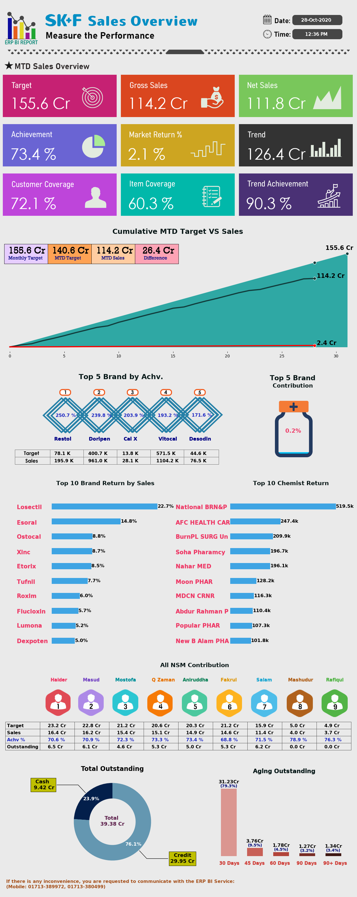

# Eskayef_monthly_sales_overview_report_generator
This projects generates a formulation report of a top pharmaceuticals company named Eskayef and sends those to the respected emails automatically.

Python programming language is used to develop this automated system.
It uses some famous libraries like Matplotlib, Numpy, Pandas and Pyodbc.
This project generates a report which has all the monthly evaluation KPI. All these KPI are generated using python. It gives an infographical overview of the Company sales information.
This project was created for eskayef pharmaceuticals ltd, a reknowned company in bangladesh.

Output:

